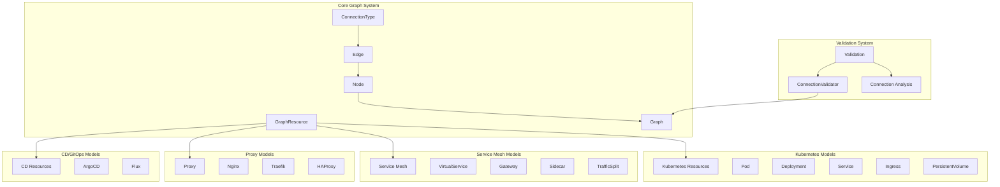
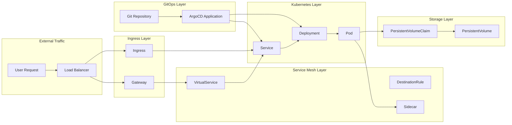
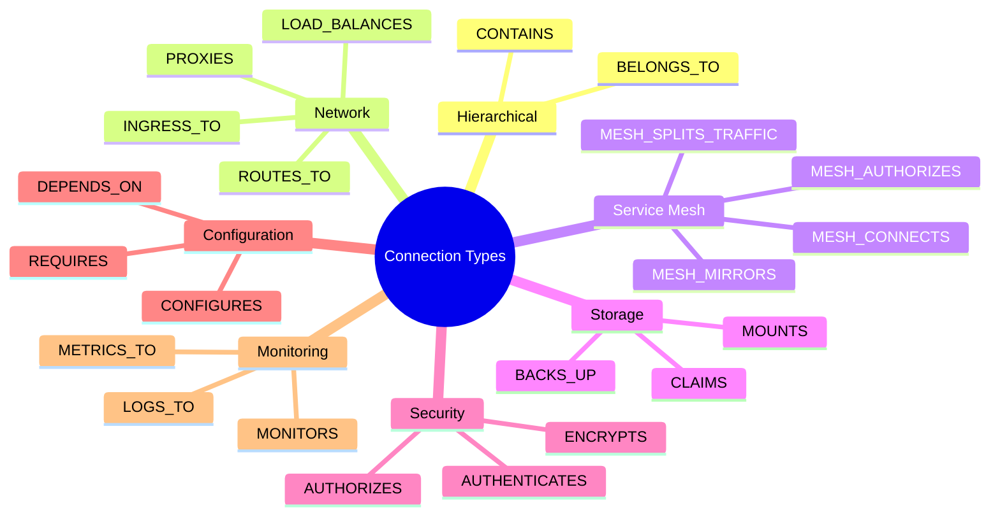
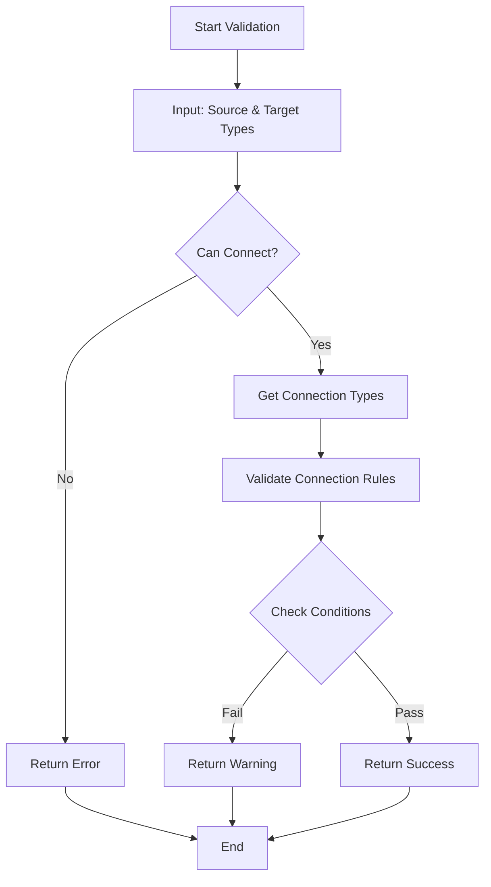

# Model Categories

This document provides detailed information about the different model categories available in the library.

## 1. Kubernetes Resources (`src/models/kubernetes/`)

Core Kubernetes resources including:

- **Workloads**: Pods, Deployments, StatefulSets, Jobs
- **Services**: Services, Endpoints, Ingress
- **Storage**: PersistentVolumes, PersistentVolumeClaims
- **Configuration**: ConfigMaps, Secrets
- **Networking**: NetworkPolicies, Services

### Example Usage

```typescript
import { Service, Deployment, ConnectionType } from '@kubegram/common-ts';

const service: Service = {
  name: 'web-service',
  type: 'Service',
  namespace: 'default',
  apiVersion: 'v1',
  kind: 'Service',
  spec: {
    type: 'ClusterIP',
    ports: [{ port: 80, targetPort: 3000 }],
    selector: { app: 'web' }
  }
};

const deployment: Deployment = {
  name: 'web-deployment',
  type: 'Deployment',
  namespace: 'default',
  apiVersion: 'apps/v1',
  kind: 'Deployment',
  spec: {
    replicas: 3,
    selector: { matchLabels: { app: 'web' } },
    template: {
      metadata: { labels: { app: 'web' } },
      spec: {
        containers: [{
          name: 'web',
          image: 'nginx:latest',
          ports: [{ containerPort: 3000 }]
        }]
      }
    }
  }
};
```

## 2. Service Mesh Resources (`src/models/service-mesh/`)

Common service mesh abstractions:

- **Traffic Management**: VirtualServices, TrafficSplits, LoadBalancers
- **Security**: AuthorizationRules, TLSConfigs
- **Observability**: ConnectionPools, OutlierDetection
- **Gateway**: GatewayServers, WorkloadEntries

## 3. Proxy Resources (`src/models/proxy/`)

Proxy server configurations:

- **Servers**: ProxyServer configurations
- **Upstreams**: ProxyUpstream definitions
- **Locations**: ProxyLocation routing rules
- **Security**: ProxySSL, ProxyAccessControl
- **Performance**: ProxyCache, ProxyRateLimit, ProxyCompression

### Example Usage

```typescript
import { ProxyGraphValidator } from '@kubegram/common-ts';

const nginxConfig = {
  name: 'api-gateway',
  type: 'NginxServer',
  server: {
    listen: 80,
    server_name: 'api.example.com',
    locations: [{
      path: '/api',
      proxy_pass: 'http://backend-service:3000'
    }]
  }
};

const validator = new ProxyGraphValidator(graph);
const validation = validator.validateNginxServer(nginxConfig);

if (validation.isValid) {
  console.log('Nginx configuration is valid');
} else {
  console.log('Issues found:', validation.errors);
}
```

## 4. Specific Implementations

### Istio (`src/models/istio/`)
- VirtualService, DestinationRule, Gateway
- Sidecar, EnvoyFilter, AuthorizationPolicy
- PeerAuthentication, RequestAuthentication

### Linkerd (`src/models/linkerd/`)
- ServiceProfile, TrafficSplit, AuthorizationPolicy
- Server, HTTPRoute, Gateway, GatewayClass

### Nginx (`src/models/nginx/`)
- NginxServer, NginxUpstream, NginxLocation
- Load balancing and caching configurations

### Traefik (`src/models/traefik/`)
- TraefikRouter, TraefikService, TraefikMiddleware
- TCP/UDP routing and TLS configurations

### HAProxy (`src/models/haproxy/`)
- HAProxyFrontend, HAProxyBackend, HAProxyListen
- Global and defaults configurations

## 5. GitOps/CD Resources (`src/models/cd/`)

Continuous Deployment tools:

- **ArgoCD**: ArgoCDApplication, ArgoCDProject, ArgoCDRepository, ArgoCDCluster
- **Flux**: FluxGitRepository, FluxKustomization, FluxHelmRelease, FluxSourceController

## 6. Validation System (`src/models/validation/`)

Comprehensive validation framework:

- **ConnectionValidator**: Validates resource connections and relationships
- **Connection Analysis**: Analyzes connection patterns and compatibility
- **Path Validation**: Validates complete connection paths

### Example Usage

```typescript
import { ConnectionValidator } from '@kubegram/common-ts';

const validator = new ConnectionValidator();

// Check if two resource types can connect
const canConnect = validator.canConnect('Service', 'Deployment');
console.log(`Can connect: ${canConnect}`);

// Get all possible connection types
const connections = validator.getConnectionTypesBetween('Service', 'Deployment');
connections.forEach(conn => {
  console.log(`Connection: ${conn.connectionType}`);
  console.log(`Description: ${conn.metadata.description}`);
});

// Get the best connection type
const bestConnection = validator.getBestConnectionType('Service', 'Deployment');
console.log(`Best connection: ${bestConnection}`);
```

## 7. Microservice Resources (`src/models/microservice.ts`)

Microservice abstraction over Kubernetes resources:

```typescript
import { Microservice } from '@kubegram/common-ts';

const microservice: Microservice = {
  name: 'user-api',
  type: 'Microservice',
  namespace: 'default',
  language: 'TypeScript',
  framework: 'Express',
  packageManager: 'npm',
  dependencies: ['express'],
  scripts: { start: 'node index.js' },
  environmentVariables: { PORT: '3000' },
  ports: [3000],
  volumes: [],
  networks: [],
  baseImage: 'node:18-alpine',
  image: 'user-api',
  version: '1.0.0'
};
```

## Architecture Diagrams

### High-Level Model Architecture



### Resource Relationship Flow



### Connection Type Categories



### Validation System Flow


