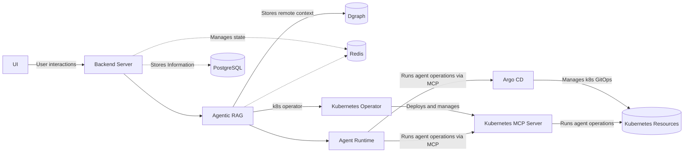

# Architecture Reference

## Overview

This is an outline for the Kubegram Architecture.

## Core Architecture

## Tech Stack

- **TypeScript** - ES2023 modules with strict mode
- **Winston** - Structured logging with rotation
- **Jest** - Testing framework
- **ESLint + Prettier** - Code quality
- **Golang** - Kubernetes Operators & sidecars

