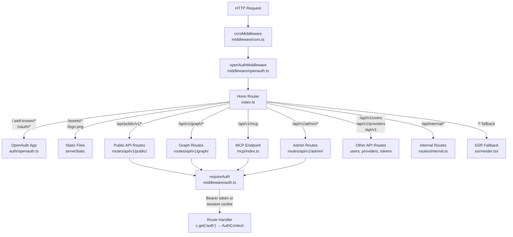
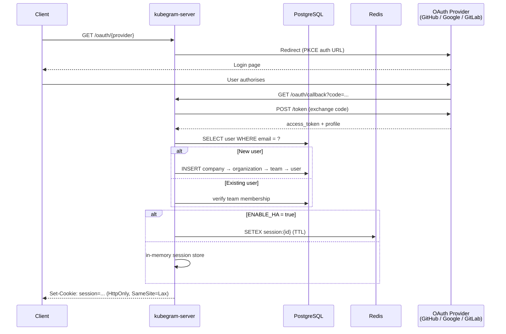
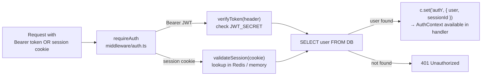
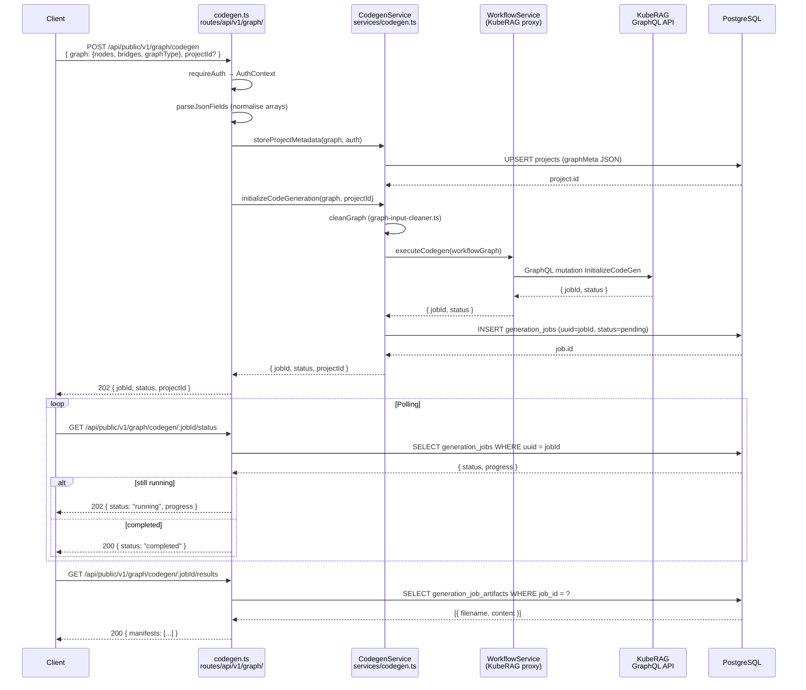
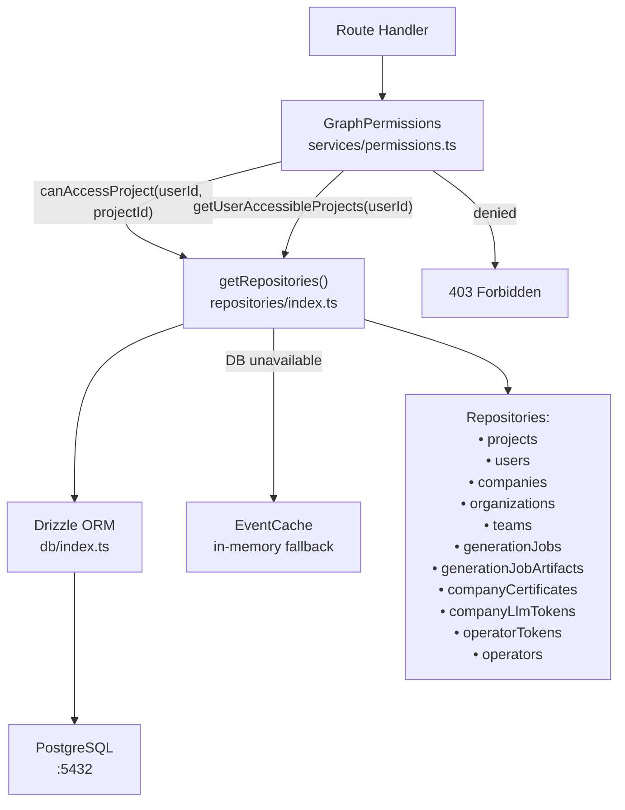
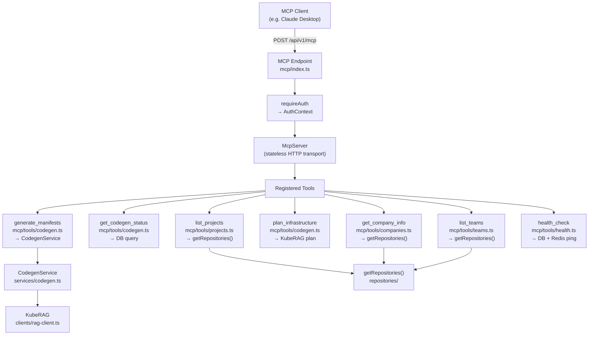
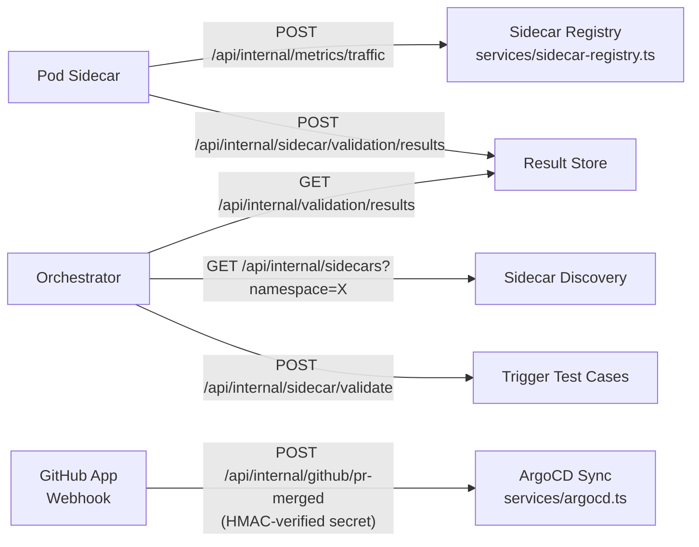

# Kubegram Server — Code Paths

API gateway and auth server built on **Hono.js** running on **Bun**, backed by **PostgreSQL** (Drizzle ORM) and optional **Redis** (HA mode). Proxies graph operations to the **KubeRAG** service.

---

## 1. Request Lifecycle

Every inbound HTTP request passes through the same middleware chain before reaching a route handler.

---

## 2. Authentication Flow

### 2a. OAuth Login (new session)

### 2b. Protected Route Access

---

## 3. Code Generation Flow

The most complex path — from canvas graph data to Kubernetes manifests.

---

## 4. Service & Repository Layers

All route handlers go through a permission check before touching the database via the repository abstraction.

---

## 5. MCP Tool Dispatch

Claude Desktop (and other MCP clients) connect via a stateless HTTP transport and call registered tools.

---

## 6. Internal Routes (no user auth)

Cluster-internal endpoints used by sidecars and CI/CD automation.

---

## Glossary

| Term | Meaning |
|------|---------|
| **KubeRAG** | RAG engine at `KUBERAG_URL` — handles LLM calls, graph analysis, vector search (Dgraph) |
| **MCP** | Model Context Protocol — lets Claude Desktop call server tools directly |
| **HA mode** | High-availability mode (`ENABLE_HA=true`) — uses Redis for session storage instead of in-memory |
| **AuthContext** | `{ user, sessionId }` injected by `requireAuth` middleware into every protected handler |
| **EventCache** | In-memory LRU/TTL cache used as fallback when PostgreSQL is unavailable |
| **Drizzle ORM** | Type-safe SQL query builder; all DB access goes through `src/db/schema.ts` definitions |
