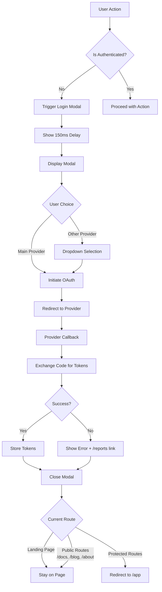

# KubeGram OAuth Flow Documentation

## Overview

This document outlines the behavior and logic of the OAuth authentication flow in KubeGram after migration to OpenAuth. The system uses a modal-based authentication approach with contextual redirects.

## Authentication Architecture

### **Modal-Based Authentication**
- **Replaced**: Traditional page-based login (`/login` route)
- **New**: Modal overlay with global state management
- **Benefits**: Seamless user experience, no page navigation required

### **OpenAuth Integration**
- **Provider**: OpenAuth.js for OAuth 2.0 compliance
- **Client ID**: `kubegram-web`
- **Issuer**: `${API_URL}/oauth`
- **Flow**: Authorization Code with PKCE

## OAuth Providers

### **Main Providers** (Primary Buttons)
1. **GitHub** - Full repository access
2. **Google** - Google account integration  
3. **Slack** - Workspace collaboration

### **Other Providers** (Dropdown Menu)
1. **Gmail** - Email access
2. **GitLab** - GitLab repository access
3. **Okta** - Enterprise SSO
4. **OIDC** - OpenID Connect
5. **SSO** - Generic Single Sign-On

## Authentication Flow

### **Trigger Points**
The login modal is automatically triggered when users attempt to:

1. **Generate code from graph** - `CodeGenerationModal.tsx`
2. **Access compare view** - `/compare-view` route
3. **Access code view** - `/code-view` route
4. **Press login button** - `LandingPage.tsx`

### **Modal Flow Diagram**


## Token Management

### **Token Structure**
```typescript
interface OpenAuthTokens {
  accessToken: string;    // Bearer token for API calls
  refreshToken?: string;   // Token for renewal
  expiresIn?: number;     // Token lifetime in seconds
  tokenType: 'Bearer';   // Token type
}
```

### **Storage**
- **Key**: `kubegram_auth`
- **Format**: JSON with `user`, `accessToken`, `refreshToken`, `isAuthenticated`
- **Location**: localStorage
- **Migration**: Automatic conversion from old `providerToken` to `accessToken`

### **Token Refresh**
- **Automatic**: Using refresh tokens when access token expires
- **Fallback**: Force re-authentication on refresh failure
- **Middleware**: Redux thunk handles renewal transparently

## Modal Behavior Logic

### **Contextual Redirects**
```javascript
// Modal dismissal logic
const publicRoutes = ['/', '/docs', '/blog', '/about'];

if (publicRoutes.includes(currentPath)) {
  // Stay on current page
  return;
} else {
  // Redirect to canvas
  navigate('/app');
}
```

### **Error Handling**
- **Display**: "An error occurred while logging you in. If error persists, please submit a report at /reports"
- **Reports Page**: Publicly accessible at `/reports`
- **Retry**: Users can retry authentication

## Environment Configuration

### **Required Variables**
```bash
VITE_API_URL=http://localhost:8090          # API server URL
VITE_FORCE_REAUTH=true/false                # Force re-authentication flag
```

### **Optional Variables** 
```bash
VITE_OIDC_CLIENT_ID=                      # OIDC client ID
VITE_OIDC_ISSUER=                         # OIDC issuer URL
```

## Implementation Details

### **Components**

#### **LoginModalWrapper** (Global State)
- Manages modal visibility and state
- Handles contextual redirects on close
- Dispatches authentication events
- Integrates with Redux state

#### **LoginModal** (UI Component)
- Dark-themed modal design
- 3 main provider buttons (prominent)
- Dropdown menu for 5 other providers
- Loading states and error handling

#### **ProtectedRoute** (Route Guard)
- Triggers modal instead of page redirects
- Renders `null` while modal is active
- Maintains route-based protection logic

#### **OAuthCallback** (Token Handler)
- Processes authorization code and state
- Exchanges code for access/refresh tokens
- Handles OAuth errors and redirects

### **State Management**

#### **OAuth Slice**
```typescript
interface OAuthState {
  user: User | null;
  accessToken: string | null;
  refreshToken: string | null;
  isLoading: boolean;
  error: string | null;
  isAuthenticated: boolean;
}
```

#### **Thunks**
- `initiateLogin` - Start OAuth flow
- `handleCallback` - Exchange code for tokens
- `refreshToken` - Renew access token
- `logoutUser` - Clear authentication

## Security Features

### **PKCE Flow**
- **Code Verifier**: Generated and stored locally
- **Code Challenge**: Sent to authorization server
- **Verification**: Ensures request integrity

### **Token Security**
- **HTTPS Only**: All OAuth requests over HTTPS
- **Secure Storage**: Tokens in localStorage (configurable)
- **Short Lifetime**: Access tokens with limited duration
- **Refresh Tokens**: Secure renewal without re-authentication

### **Environment Controls**
- **Force Re-auth**: Clear all tokens on deployment
- **Development/Production**: Separate configurations
- **Domain Restrictions**: Callback URLs controlled

## Migration Notes

### **From Custom Auth to OpenAuth**
1. **Removed**: `src/store/api/auth.ts`
2. **Added**: `src/store/api/openauth.ts`
3. **Updated**: OAuth types and thunks
4. **Enhanced**: Token structure with refresh support

### **From Page to Modal**
1. **Removed**: `/login` route and `LoginPage.tsx`
2. **Added**: Global `LoginModalWrapper`
3. **Updated**: `ProtectedRoute` to emit events
4. **Enhanced**: Contextual redirect logic

## Testing Scenarios

### **Happy Paths**
1. ✅ User clicks protected route → Modal appears → OAuth success → Stay on page
2. ✅ User on landing page → Modal appears → OAuth success → Stay on landing
3. ✅ User dismisses modal → Contextual redirect works correctly

### **Error Cases**
1. ✅ OAuth provider error → Error message with /reports link
2. ✅ Network failure → Retry option available
3. ✅ Invalid code → Clear error message

### **Edge Cases**
1. ✅ Token expired → Automatic refresh
2. ✅ Refresh failed → Force re-authentication
3. ✅ Multiple tabs → Sync authentication state

## Future Enhancements

### **Planned Features**
- [ ] User profile management
- [ ] Provider preference memory
- [ ] Biometric authentication
- [ ] Session timeout warnings

### **Potential Improvements**
- [ ] WebSocket authentication sync
- [ ] Progressive Web App support
- [ ] Offline authentication handling

---

**Last Updated**: January 2026
**Version**: 2.0.0 (OpenAuth Migration)
**Author**: KubeGram Development Team