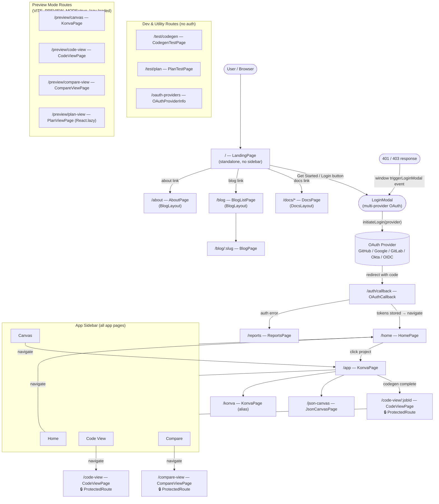
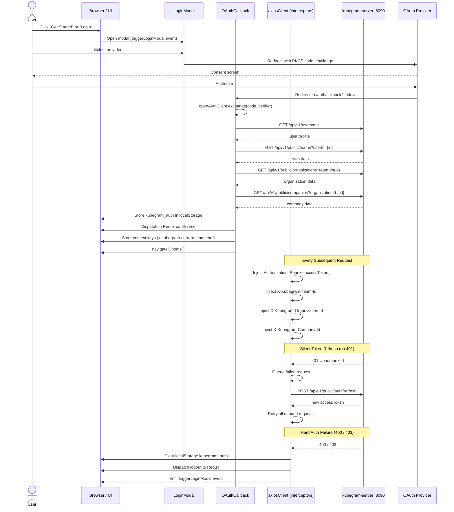
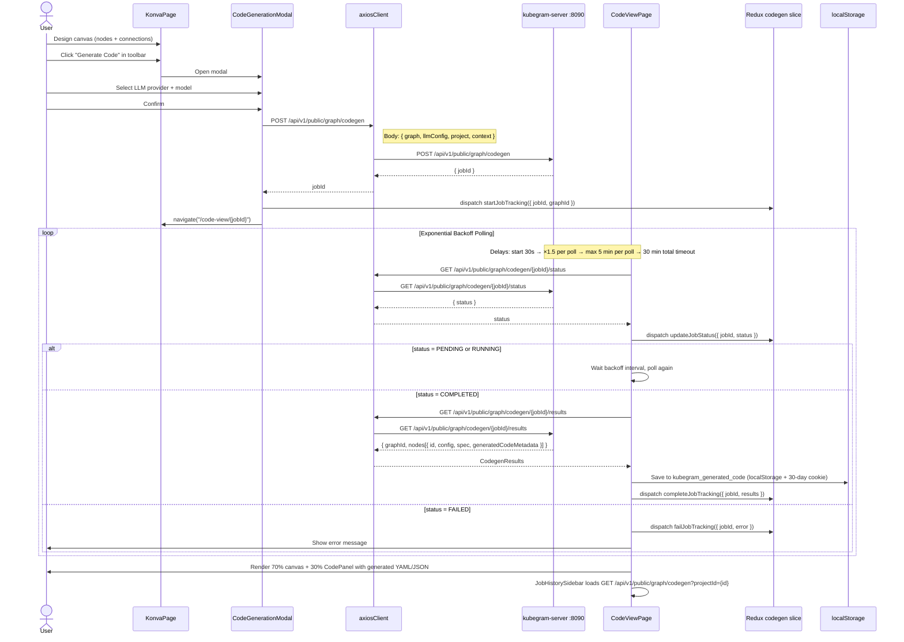
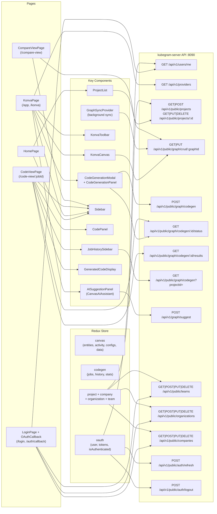

# Kubegram UI — Diagrams

Four diagrams covering routes & navigation, auth flow, code generation flow, and the component/API map.

---

## 1. Route & Navigation Flow

---

## 2. OAuth & Auth Flow

---

## 3. Code Generation Flow

---

## 4. Component & API Map

