# Architecture

Kubegram's architecture represents a paradigm shift in Kubernetes infrastructure management, combining visual design interfaces, AI-powered orchestration, and GitOps automation into a cohesive, agentic ecosystem.

## 🏗️ High-Level System Architecture

### Core Components Overview

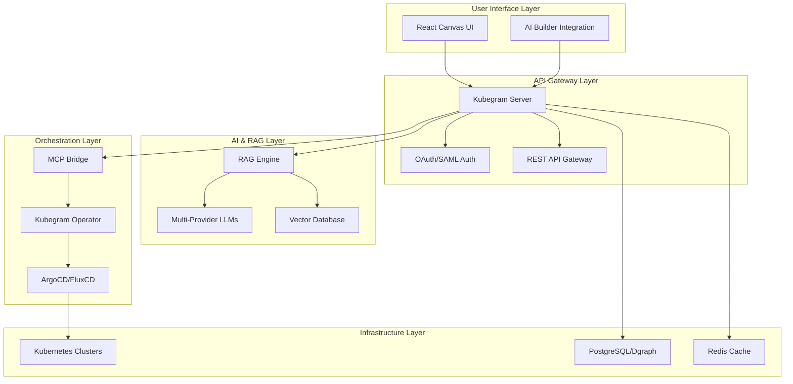

## 🧠 Agentic Orchestration Architecture

The agentic layer is what makes Kubegram revolutionary - it transforms static infrastructure into a living, responsive ecosystem.

### Model Context Protocol (MCP) Bridge

The MCP bridge establishes a bi-directional communication channel between AI agents and Kubernetes infrastructure:

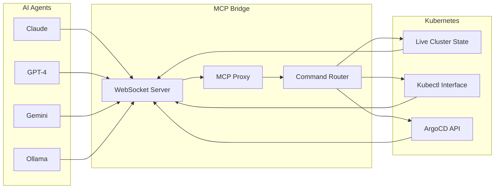

**Key Capabilities:**
- **Real-time State Synchronization**: Cluster state changes are immediately available to AI agents
- **Bi-directional Command Flow**: AI agents can both observe and modify cluster state
- **Secure Context Isolation**: Each agent operates within scoped permissions
- **Multi-Provider Support**: Connect Claude, OpenAI, Gemini, DeepSeek, Ollama simultaneously

## 🎨 Visual Design System

### Canvas Architecture

The visual designer is built on a sophisticated canvas system that translates user interactions into infrastructure intent:

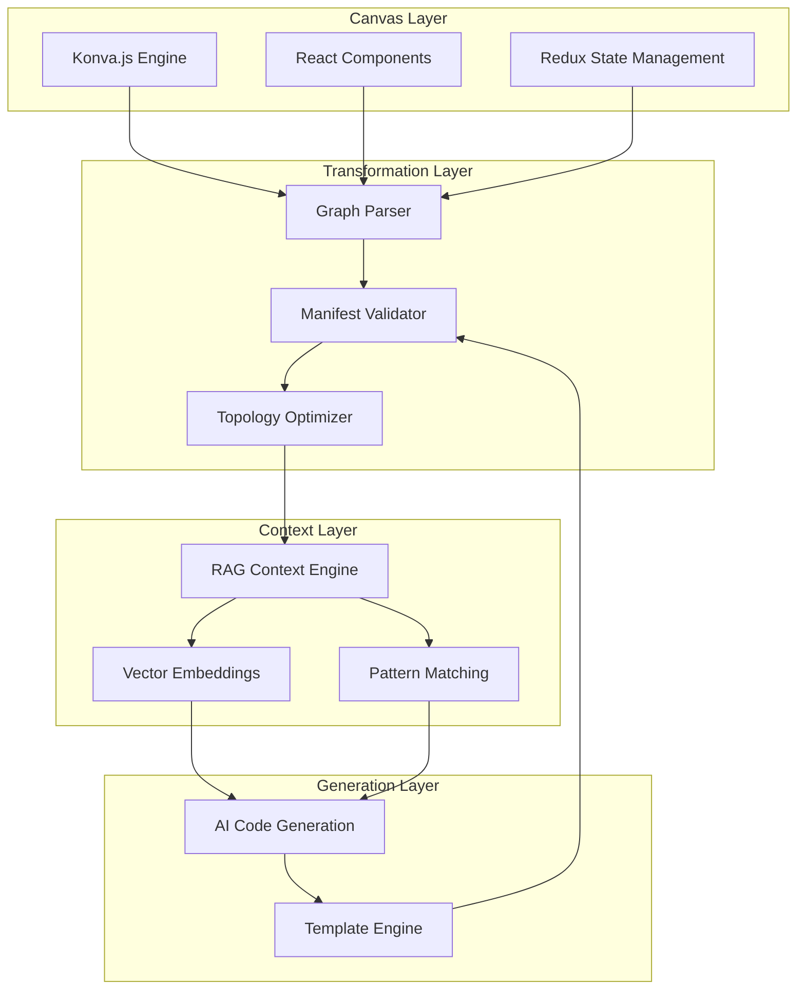

### Node Types and Behaviors

| Node Type | Visual Representation | AI Capabilities | Typical Configurations |
|-----------|---------------------|------------------|----------------------|
| **Microservice** | Rounded rectangle | Auto-scaling, health checks | Replicas, resource limits, probes |
| **Database** | Cylinder | Backup strategies, scaling | Storage class, version, HA |
| **Load Balancer** | Diamond | Traffic routing, SSL termination | Algorithm, health checks, TLS |
| **Message Queue** | Trapezoid | Queue depth monitoring, scaling | Broker type, persistence, partitions |
| **Cache** | Hexagon | Cache invalidation, warming | Engine, size, eviction policy |
| **API Gateway** | Pentagon | Rate limiting, auth | Routes, plugins, CORS |

## 🔀 Data Flow Architecture

### Visual-to-Code Pipeline

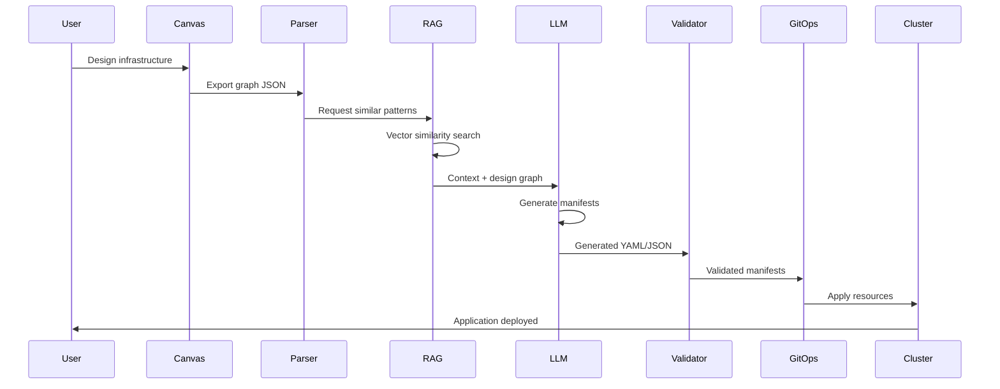

### AI Agent Interaction Flow

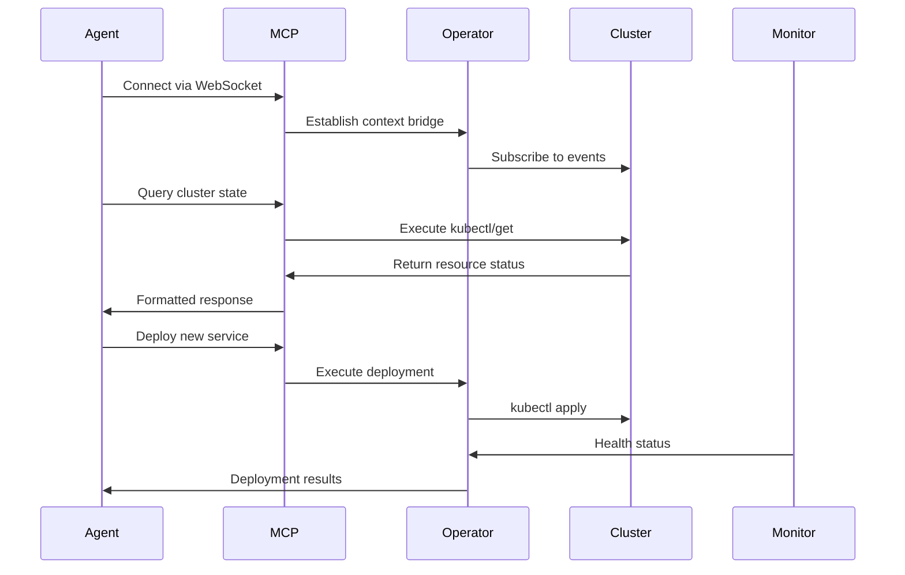

## 🔐 Security Architecture

### Zero-Trust Security Model

```mermaid
graph TB
    subgraph "Identity Layer"
        SSO[SAML/OAuth Providers]
        RBAC[Role-Based Access Control]
        MFA[Multi-Factor Auth]
    end
    
    subgraph "Network Security"
        mTLS[Mutual TLS]
        NetworkPolicies[Network Policies]
        ServiceMesh[Service Mesh]
    end
    
    subgraph "Data Protection"
        Encryption[Data Encryption]
        Secrets[Secret Management]
        Audit[Audit Logging]
    end
    
    subgraph "Compliance"
        CIS[CIS Benchmarks]
        Policies[Policy as Code]
        Scanning[Vulnerability Scanning]
    end
    
    SSO --> RBAC
    RBAC --> MFA
    mTLS --> NetworkPolicies
    NetworkPolicies --> ServiceMesh
    Encryption --> Secrets
    Secrets --> Audit
    CIS --> Policies
    Policies --> Scanning
```

### Authentication & Authorization Flow

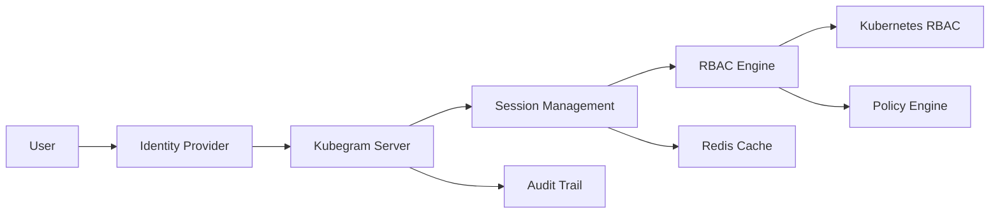

## 📊 State Management Architecture

### Distributed State Synchronization

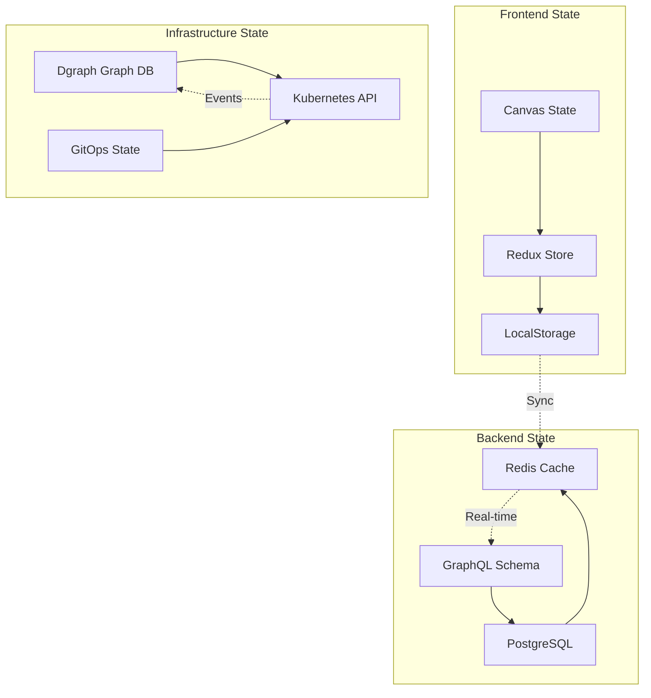

### Caching Strategy

| Cache Layer | Purpose | TTL | Eviction Policy |
|-------------|---------|-----|----------------|
| **Browser Cache** | Static assets | 24h | LRU |
| **Redux Store** | UI state | Session | Manual |
| **Redis Cache** | API responses | 5m | LRU |
| **Vector Cache** | Embeddings | 1h | LRU |
| **Kubernetes Cache** | Resource states | 30s | TTL |

## 🚀 Scalability Architecture

### Horizontal Scaling Patterns

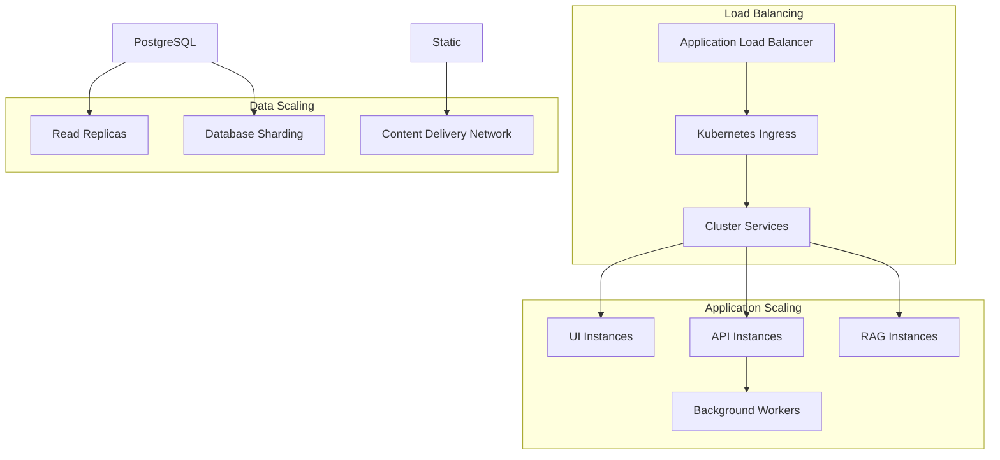

### Performance Optimization Strategies

**Frontend Optimizations:**
- Virtualized canvas rendering for large infrastructure graphs
- React.memo for component re-render prevention
- Web Workers for complex graph calculations
- Code splitting with lazy loading

**Backend Optimizations:**
- Connection pooling for database connections
- Redis-based caching for frequently accessed data
- Async job processing for AI workflows
- GraphQL query optimization

**Infrastructure Optimizations:**
- Auto-scaling based on CPU/memory metrics
- Pod disruption budgets for availability
- Resource requests and limits for QoS
- Priority classes for critical workloads

## 🔧 Integration Architecture

### Multi-Provider AI Integration

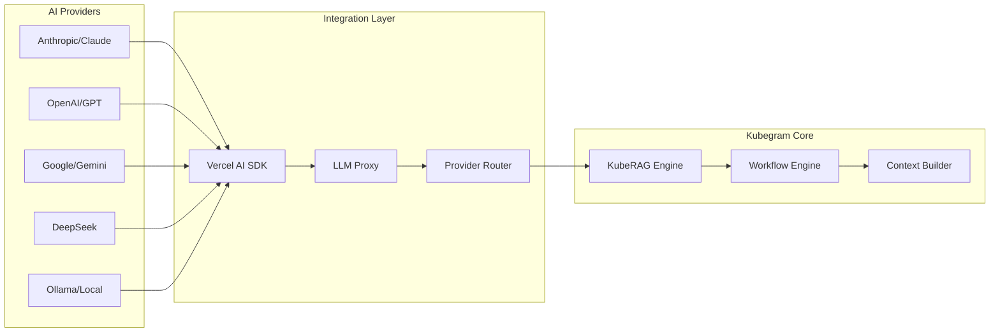

### GitOps Integration Patterns

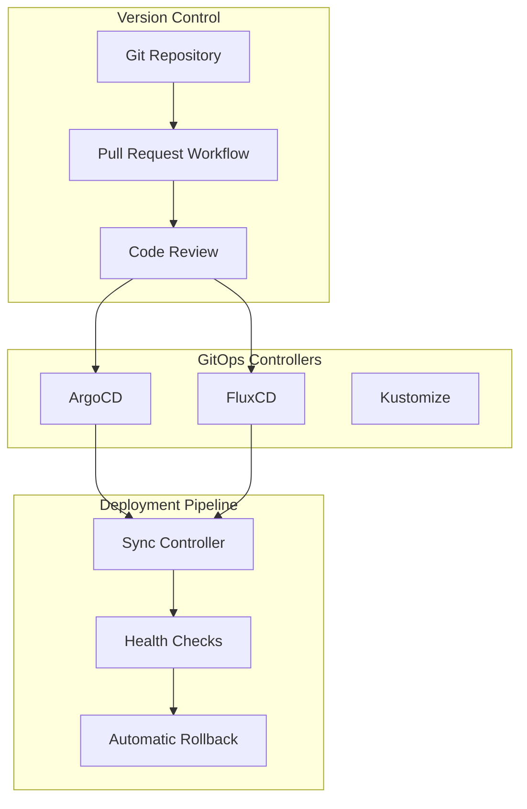

## 📈 Monitoring & Observability

### Observability Stack

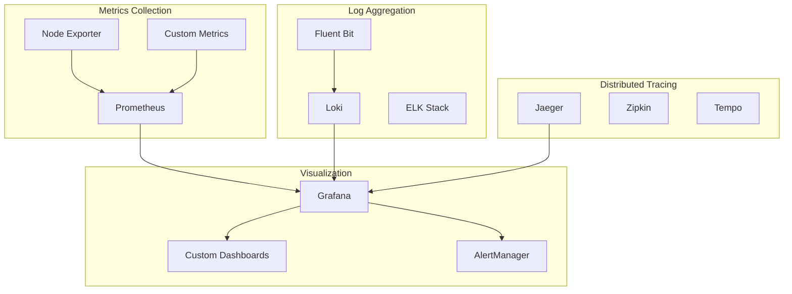

### Key Metrics & Alerts

| Metric Category | Key Metrics | Alert Thresholds |
|----------------|-------------|------------------|
| **System Health** | CPU, Memory, Disk Usage | >80% for 5min |
| **Application** | Response Time, Error Rate | >500ms, >5% errors |
| **AI Workflows** | Generation Time, Success Rate | >30s, <95% success |
| **GitOps** | Sync Status, Rollback Rate | Failed sync, >1/hour |

## 🔮 Future Architecture Evolution

### Planned Enhancements

1. **Multi-Cluster Management**
   - Federated control plane
   - Cross-cluster service mesh
   - Global load balancing

2. **Advanced AI Capabilities**
   - Infrastructure cost optimization
   - Performance tuning recommendations
   - Predictive failure analysis

3. **Enterprise Features**
   - Advanced compliance reporting
   - Custom policy frameworks
   - Integration with enterprise systems

4. **Developer Experience**
   - VS Code extension
   - CLI tools
   - Mobile application

### Architecture Principles

- **Modularity**: Every component is independently deployable and scalable
- **Extensibility**: Plugin architecture for custom integrations
- **Security**: Zero-trust model with defense in depth
- **Observability**: Comprehensive monitoring and tracing
- **Performance**: Optimized for scale and low latency
- **Reliability**: Built-in redundancy and self-healing

This architecture enables Kubegram to transform static Kubernetes management into an intelligent, autonomous, and highly productive platform for modern infrastructure teams.