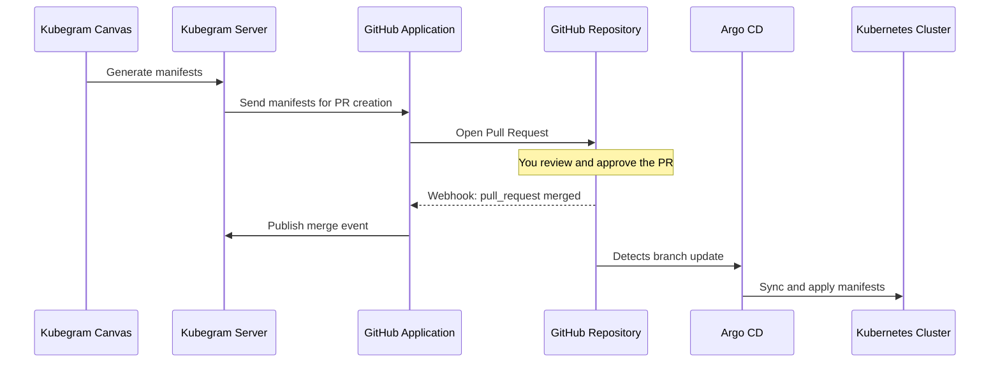

<!-- order: 3 -->

# Kubegram GitHub Application

## Overview

The Kubegram GitHub Application is an open-source bridge that connects three systems: **Kubegram**, **GitHub**, and **Argo CD**.

When you design infrastructure on the Kubegram visual canvas and generate Kubernetes manifests, those manifests do not go directly to your cluster. Instead, they flow through GitHub as a Pull Request — giving you a review step before any change reaches production. Once the PR is merged, Argo CD detects the change in your repository and syncs the manifests to your cluster automatically.

This GitOps-native workflow ensures that every infrastructure change is:

- Reviewed and approved before it is applied
- Tracked in version control with a full audit trail
- Applied by Argo CD through its standard reconciliation loop, not by Kubegram directly

---

## How It Works

At a high level, the flow from canvas design to running cluster looks like this:

1. You design your infrastructure on the Kubegram canvas and initiate manifest generation
2. Kubegram generates Kubernetes manifests and sends them to the Kubegram GitHub Application
3. The GitHub Application opens a Pull Request in your repository with the generated manifests
4. You review the PR, make any adjustments, and approve it
5. Merging the PR pushes the changes to your default branch
6. Argo CD detects the branch update and syncs the new manifests to your cluster

---

## Prerequisites

Before using the GitHub Application integration, you need:

- A GitHub repository designated for your Kubernetes manifests
- The Kubegram GitHub Application installed on that repository
- Argo CD deployed and configured to watch your manifest repository
- Kubegram configured with your GitHub App credentials (App ID, private key, and webhook secret)

---

## The GitOps Flow in Detail

### 1. Design and generate manifests

On the Kubegram visual canvas, arrange your infrastructure components — services, deployments, ingress rules, config maps, and so on. When your design is ready, trigger manifest generation. Kubegram's AI orchestration layer translates your canvas into Kubernetes YAML.

### 2. Kubegram sends manifests to the GitHub Application

After generation, Kubegram sends the manifests to the GitHub Application service. The application authenticates with GitHub using a short-lived installation token tied to your GitHub App credentials, then opens a branch in your repository with the generated files.

### 3. The GitHub Application opens a Pull Request

The application creates a Pull Request targeting your default branch. The PR includes:

- All generated Kubernetes manifest files
- A description summarizing what was generated
- Any relevant metadata from the generation job (project name, graph ID, timestamp)

### 4. You review and approve the PR

Review the PR in GitHub as you would any infrastructure change. You can:

- Inspect the generated YAML files directly in the PR diff
- Run your existing CI checks (linting, validation, policy checks)
- Request changes or leave comments
- Approve and merge when satisfied

Nothing is applied to your cluster until you merge.

### 5. The merge triggers a downstream event

When the PR is merged, GitHub sends a webhook event to the Kubegram GitHub Application. The application processes the merge event and publishes it to the internal Kubegram event bus, making the merge available to any downstream services that subscribe to it.

### 6. Argo CD syncs the cluster

Argo CD watches your repository for changes to the default branch. When the PR merge lands, Argo CD detects the new commit and begins its standard sync process — applying the manifest changes to your target Kubernetes cluster.

---

## Setting Up the Integration

### Install the Kubegram GitHub App

1. Navigate to your GitHub organization or personal account settings
2. Go to **Developer Settings → GitHub Apps → New GitHub App**
3. Set the webhook URL to your Kubegram GitHub Application endpoint: `https://<your-domain>/api/github/webhooks`
4. Generate a webhook secret and save it — you will need this for Kubegram configuration
5. Grant the following repository permissions:

    | Permission | Level |
    |---|---|
    | Contents | Read & Write |
    | Metadata | Read |
    | Pull requests | Read & Write |
    | Checks | Read |

6. Subscribe to events: **Push**, **Pull requests**, **Releases**, **Check runs**
7. Generate and download a private key for the app
8. Install the app on the target repository

### Configure Kubegram

Provide the following values in your Kubegram GitHub Application configuration:

| Variable | Description |
|---|---|
| `GITHUB_APP_ID` | The numeric App ID from your GitHub App settings page |
| `GITHUB_PRIVATE_KEY` | The PEM-encoded private key downloaded during app setup |
| `GITHUB_WEBHOOK_SECRET` | The webhook secret you generated during app setup |

### Configure Argo CD

Point an Argo CD `Application` resource at your manifest repository and set the target revision to your default branch (typically `main`). Enable auto-sync if you want Argo CD to apply changes automatically after each merge, or leave it on manual sync if you prefer an extra confirmation step.

---

## Pull Request Lifecycle

Each Pull Request created by the Kubegram GitHub Application follows a consistent lifecycle:

- **Opened** — the app pushes a branch and opens the PR against your default branch
- **CI runs** — any existing checks or actions in your repository run on the PR branch
- **Review** — team members review the manifest diff and leave comments or approvals
- **Merged** — the PR is squash- or merge-committed to the default branch
- **Branch cleanup** — the feature branch created by the app is deleted after merge

You can require approvals and passing checks before merge by configuring branch protection rules on your default branch in GitHub. The Kubegram GitHub Application respects all standard GitHub branch protection rules.

---

## Argo CD Sync Behavior

After a PR is merged, Argo CD reconciles your cluster based on the updated manifests. The exact behavior depends on your Argo CD `Application` sync policy:

- **Automated sync** — Argo CD detects the new commit within its polling interval (default: 3 minutes) and applies the changes without manual intervention
- **Manual sync** — Argo CD marks the application as out-of-sync and waits for you to trigger a sync from the Argo CD UI or CLI

In both cases, Argo CD performs a diff between the current cluster state and the desired state from the repository before applying any changes. Resources are created, updated, or deleted as needed to bring the cluster into the desired state.

---

## Troubleshooting

**Webhook events are not arriving**

Verify that the Kubegram GitHub Application is reachable from the internet at the webhook URL you configured. In GitHub, go to your App settings → **Advanced** → **Recent Deliveries** to see whether GitHub is successfully delivering webhook payloads and what response codes it receives.

**Pull Request is not created after manifest generation**

Check that the GitHub App is installed on the correct repository and that the app has **Contents: Read & Write** and **Pull requests: Read & Write** permissions. Review the Kubegram GitHub Application logs for authentication errors, which typically indicate a mismatch in the App ID or private key.

**Argo CD is not syncing after the PR is merged**

Confirm that the Argo CD `Application` resource targets the correct repository URL and branch. If using SSH authentication, verify the deploy key is still valid. If auto-sync is enabled, check the Argo CD controller logs for sync errors. You can also trigger a manual sync from the Argo CD UI to diagnose whether the issue is with sync triggering or with the manifests themselves.

**Manifest validation fails in the PR**

If your repository has CI checks that validate Kubernetes manifests (e.g., `kubeval`, `kustomize build`, OPA/Gatekeeper policies), those checks run against the generated YAML before merge. Review the check output in the PR, correct any issues on the canvas or by editing the generated files directly, and push a new commit to the PR branch.

---

## Next Steps

- [Deployment Guide](./deployment) — overall deployment topologies and the control-plane / workload-cluster model
- [Visual Designer Guide](../visual-designer/canvas-guide) — design the infrastructure that feeds into this GitOps flow
- [AI Orchestration Concepts](../AI-orchestration/concepts) — understand how Kubegram generates manifests from your canvas design
