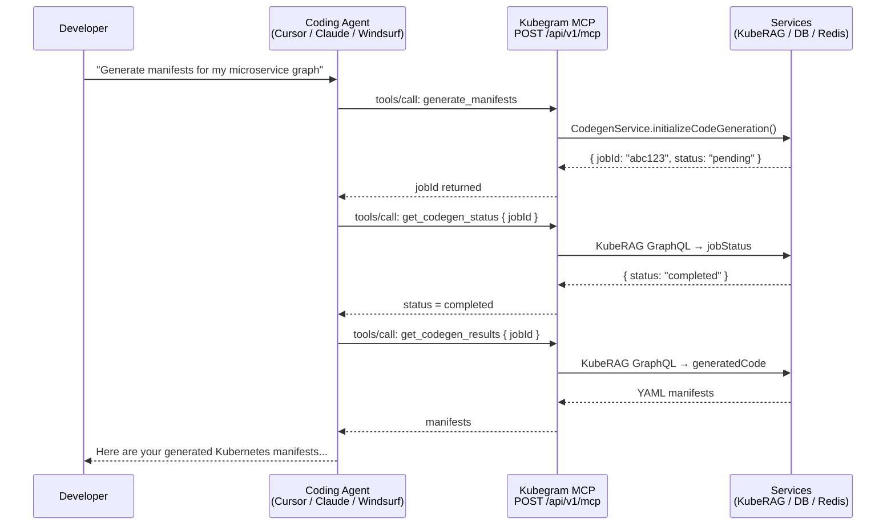
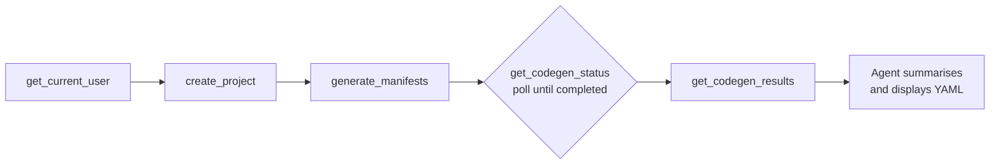
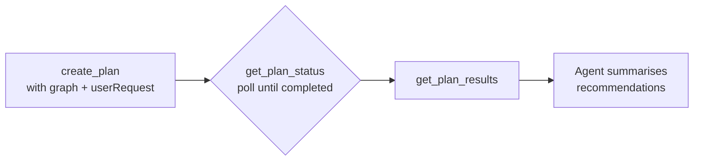
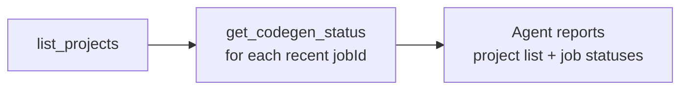

<!-- order: 2 -->

# AI Agent Integration via MCP

Kubegram exposes a [Model Context Protocol (MCP)](https://modelcontextprotocol.io) server that lets any MCP-compatible coding agent — Cursor, Claude Desktop, Claude Code, Windsurf, and others — interact with your Kubegram workspace using natural language. Instead of navigating the UI manually, you can ask your agent to generate Kubernetes manifests, create infrastructure plans, browse projects, and check job status, all from within your editor.

---

## How It Works



The MCP server runs inside `kubegram-server` at `POST /api/v1/mcp`. It uses the **Streamable HTTP transport** in stateless mode — every request is independent, no persistent connection required.

---

## Getting Your Token

Every MCP request requires a valid Bearer JWT from kubegram-server.

**Option 1 — From the Kubegram UI:**
1. Log in at `http://localhost:3000` (or your hosted URL)
2. Open browser DevTools → Application → Local Storage
3. Find the key `kubegram_auth` and copy the `accessToken` value

**Option 2 — From the auth endpoint:**
```bash
# After completing the OAuth flow, your token is returned in the callback.
# The UI stores it automatically; for headless use, complete the flow once
# and extract the token from the kubegram_auth localStorage item.
```

The token is a JWT that is validated on every MCP request. It carries your user identity and team membership, which scope all tool results automatically.

---

## Setup by Agent

Replace `<your-token>` with your JWT in all examples below. Replace `http://localhost:8090` with your kubegram-server URL if running remotely.

### Cursor

Create or edit `.cursor/mcp.json` in your project root (or `~/.cursor/mcp.json` for global config):

```json
{
  "mcpServers": {
    "kubegram": {
      "url": "http://localhost:8090/api/v1/mcp",
      "headers": {
        "Authorization": "Bearer <your-token>"
      }
    }
  }
}
```

Restart Cursor. Kubegram tools will appear in the agent's tool list automatically.

---

### Claude Desktop

Edit `claude_desktop_config.json`:
- **macOS**: `~/Library/Application Support/Claude/claude_desktop_config.json`
- **Windows**: `%APPDATA%\Claude\claude_desktop_config.json`

```json
{
  "mcpServers": {
    "kubegram": {
      "type": "http",
      "url": "http://localhost:8090/api/v1/mcp",
      "headers": {
        "Authorization": "Bearer <your-token>"
      }
    }
  }
}
```

Restart Claude Desktop. You will see "kubegram" listed in the MCP integrations panel.

---

### Claude Code

Add to `~/.claude/settings.json`:

```json
{
  "mcpServers": {
    "kubegram": {
      "type": "http",
      "url": "http://localhost:8090/api/v1/mcp",
      "headers": {
        "Authorization": "Bearer <your-token>"
      }
    }
  }
}
```

Or pass it at startup:

```bash
claude --mcp-server "kubegram:http://localhost:8090/api/v1/mcp" \
  --header "Authorization: Bearer <your-token>"
```

---

### Windsurf

Edit `~/.windsurf/mcp.json` (global) or `.windsurf/mcp.json` (project-scoped):

```json
{
  "mcpServers": {
    "kubegram": {
      "serverUrl": "http://localhost:8090/api/v1/mcp",
      "headers": {
        "Authorization": "Bearer <your-token>"
      }
    }
  }
}
```

---

### Continue.dev

Add to your `~/.continue/config.json` under `mcpServers`:

```json
{
  "mcpServers": [
    {
      "name": "kubegram",
      "transport": {
        "type": "http",
        "url": "http://localhost:8090/api/v1/mcp",
        "headers": {
          "Authorization": "Bearer <your-token>"
        }
      }
    }
  ]
}
```

---

## Available Tools

### Projects

| Tool | Description |
|---|---|
| `list_projects` | List all projects accessible to the current user (team-scoped) |
| `get_project` | Get a project by its numeric ID |
| `create_project` | Create a new project in your team |
| `update_project` | Update a project's name or graph metadata |
| `delete_project` | Soft-delete a project |

### Code Generation

| Tool | Description |
|---|---|
| `generate_manifests` | Start a Kubernetes manifest generation job from a graph. Returns a `jobId`. |
| `get_codegen_status` | Check the status of a generation job (`pending` → `running` → `completed` / `failed`) |
| `get_codegen_results` | Retrieve the generated YAML manifests for a completed job |
| `cancel_codegen` | Cancel a running generation job |

### Infrastructure Planning

| Tool | Description |
|---|---|
| `create_plan` | Start an AI-driven infrastructure planning job for a graph |
| `get_plan_status` | Check the status of a planning job |
| `get_plan_results` | Retrieve the results of a completed planning job |

### Companies & Teams

| Tool | Description |
|---|---|
| `list_companies` | List all companies |
| `get_company` | Get a company by its UUID |
| `list_teams` | List all teams |
| `get_team` | Get a team by its numeric ID |

### Users & Health

| Tool | Description |
|---|---|
| `get_current_user` | Get your user profile (id, email, role, teamId) |
| `check_health` | Check server and database health |

---

## Workflow Examples

### 1. Generate Kubernetes Manifests

**What you say to the agent:**
> *"Generate Kubernetes manifests for my web app graph. It has a frontend deployment, a backend API, and a Redis cache, all in the production namespace."*

**What the agent does:**



The agent creates a project, submits the graph description as nodes to `generate_manifests`, polls `get_codegen_status` until the job completes, then fetches and presents the generated YAML manifests directly in your chat window.

---

### 2. Create an Infrastructure Plan

**What you say:**
> *"Review the nodes I've designed and give me a plan for the infrastructure, including recommendations on resource limits and network policies."*

**What the agent does:**



The `userRequest` field in `create_plan` carries your natural-language instruction directly to the LLM planner, so the output is tailored to your request.

---

### 3. Audit Current Projects and Jobs

**What you say:**
> *"Show me all my projects and tell me the status of any pending code generation jobs."*

**What the agent does:**



---

## Raw JSON-RPC Reference

For custom integrations or scripting, you can call the MCP server directly over HTTP.

### List all tools

```bash
curl -X POST http://localhost:8090/api/v1/mcp \
  -H "Authorization: Bearer <token>" \
  -H "Content-Type: application/json" \
  -d '{
    "jsonrpc": "2.0",
    "id": 1,
    "method": "tools/list",
    "params": {}
  }'
```

### Call `generate_manifests`

```bash
curl -X POST http://localhost:8090/api/v1/mcp \
  -H "Authorization: Bearer <token>" \
  -H "Content-Type: application/json" \
  -d '{
    "jsonrpc": "2.0",
    "id": 2,
    "method": "tools/call",
    "params": {
      "name": "generate_manifests",
      "arguments": {
        "graphName": "my-web-app",
        "graphType": "MICROSERVICE",
        "companyId": "acme-corp-uuid",
        "nodes": [
          { "id": "frontend", "type": "Deployment", "data": { "name": "frontend", "image": "nginx:latest", "replicas": 2 } },
          { "id": "backend",  "type": "Deployment", "data": { "name": "api",      "image": "my-api:1.0",   "replicas": 3 } },
          { "id": "redis",    "type": "StatefulSet", "data": { "name": "redis",   "image": "redis:7" } }
        ],
        "projectName": "Web App v2",
        "llmProvider": "CLAUDE"
      }
    }
  }'
```

**Response** (abbreviated):
```json
{
  "jsonrpc": "2.0",
  "id": 2,
  "result": {
    "content": [{
      "type": "text",
      "text": "{\n  \"jobId\": \"job_1234abc\",\n  \"status\": \"pending\",\n  \"step\": \"initializing\",\n  \"projectId\": 42\n}"
    }]
  }
}
```

Poll `get_codegen_status` with `jobId` until `status` is `"completed"`, then call `get_codegen_results`.

---

## Best Practices

| Do | Don't |
|---|---|
| ✅ Keep prompts focused — one task per conversation turn | ❌ Ask for manifests + a plan + a status report in one go |
| ✅ Poll `get_codegen_status` with a 3–5 second delay between calls | ❌ Call `get_codegen_results` before the job is `completed` |
| ✅ Cancel stale jobs with `cancel_codegen` when you start over | ❌ Leave multiple parallel jobs running for the same project |
| ✅ Store your token securely (env var, secret manager) | ❌ Commit the Bearer token to version control |
| ✅ Use `check_health` at the start of a session to verify connectivity | ❌ Assume the server is up without checking |
| ✅ Scope graph nodes to what you actually need generated | ❌ Pass an entire canvas with unrelated nodes to reduce noise |

---

## Next Steps

- [Use Your Tools](./use-your-tools) — connect your editor or AI assistant to Kubegram with ready-made config snippets
- [Local Development Setup](../getting-started/setup) — install and run Kubegram locally before configuring your agent
