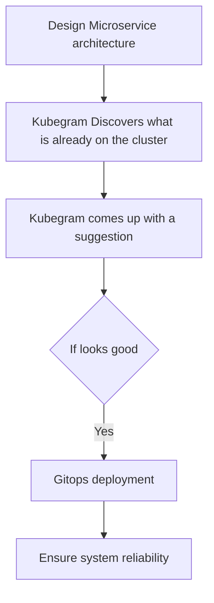

# Kubegram

**Visualize, architect, and deploy.** Kubegram is the premier visual infrastructure design platform for Kubernetes.

Kubegram seamlessly bridges the gap between high-level architectural diagrams and low-level Infrastructure as Code (IaC). It empowers platform engineers to architect complex Kubernetes clusters using an intuitive drag-and-drop interface, automatically generating production-ready Terraform, Helm charts, and Kubernetes manifests that adhere to strict industry best practices.

## Key Features

### Core Capabilities

- **Visual Architecture**: Drag, drop, and connect nodes to design your entire infrastructure visually. Transform abstract concepts into concrete configurations instantly.
- **Works with Argo CD**: Configure Argo CD to sync your infrastructure code to your Kubernetes cluster and manage your cluster's lifecycle.
- **Bi-directional Sync**: Your source of truth is unified. Code changes update the visual diagram in real-time, and visual changes automatically refactor the underlying code.
- **AI-Powered Acceleration**: Leverage advanced AI to generate boilerplate, optimized configurations, and intelligent architecture suggestions, significantly reducing development time.

### Security & Deployment

- **Secure by Default**: Built on zero-trust principles. Every request is strictly authenticated and encrypted via mTLS.
- **Private & Local**: Your data remains yours. Bring your own agent and run Kubegram entirely within your secure environment without external dependencies.
- **Self-Hosted & Open Source**: Deploy Kubegram on your own infrastructure with zero licensing fees. We are community-driven and transparent—join us on [GitHub](https://github.com/kubegram/kubegram).

### Support

- **Enterprise Support**: *(Coming Soon)* Tailored support packages for mission-critical deployments.

## At a glance

Here is a high-level overview of how Kubegram works:

## Getting Started

Check out the [Getting Started](/docs/getting-started) guide to build your first cluster.
