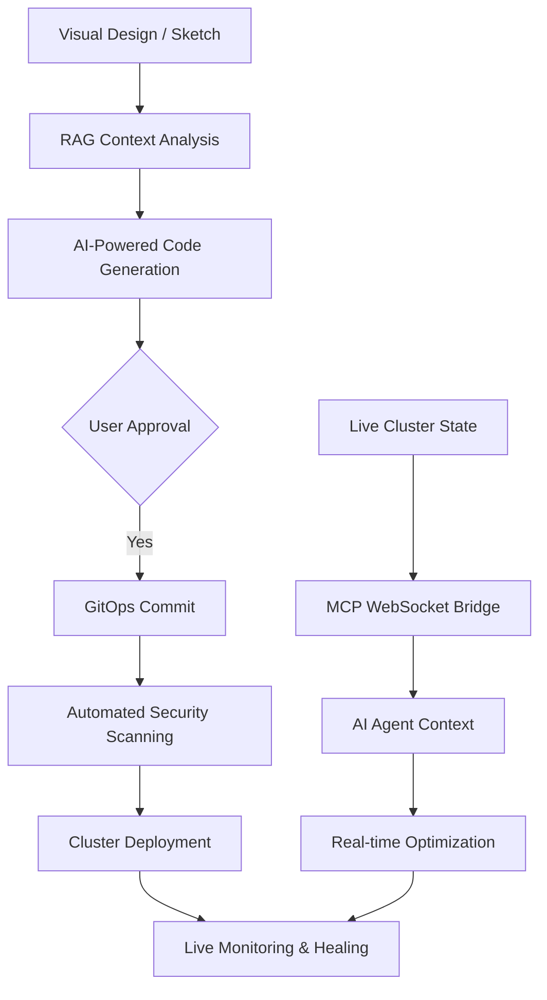

# Kubegram: The Agentic Orchestration Layer for Kubernetes

**Transform static Kubernetes management into an autonomous, intelligent ecosystem.**

Kubegram is an Open Source Platform-as-a-Service (PaaS) that revolutionizes how you design, deploy, and manage Kubernetes infrastructure. By combining Large Language Models (LLMs), Retrieval-Augmented Generation (RAG), and visual design interfaces, Kubegram bridges the gap between architectural intent and production-ready GitOps execution. 

## Table of Contents

- [Core Vision: From Vision to Infrastructure](#core-vision-from-vision-to-infrastructure)
- [How It Works](#how-it-works)
- [Who Uses Kubegram](#who-uses-kubegram)
- [Key Capabilities](#key-capabilities)
- [Use Cases](#use-cases)
- [Security \& Compliance](#security--compliance)
- [Getting Started](#getting-started)
- [Community \& Open Source](#community--open-source)

## Core Vision: From Vision to Infrastructure

Kubegram's agentic orchestration layer enables you to:

### Visual-to-Infrastructure Synthesis
- **Whiteboard-to-Code**: Upload architectural sketches or abstract graphs and watch as the RAG system transforms them into high-fidelity Kubernetes manifests
- **Intelligent Design Planning**: Get dynamic C4 model diagrams representing your proposed infrastructure before deployment

### Agentic Ecosystem Integration
- **Universal Compatibility**: Works with any Kubernetes distribution (EKS, GKE, AKS, DigitalOcean, on-premise)
- **AI Tool Synchronization**: Seamlessly integrates with AI-driven builders like Bolt, Lovable, and Retool
- **Live Cluster Context**: The Kubegram Operator establishes persistent WebSocket connections, making your cluster a "live context source" for AI agents

### Autonomous Operations
- **Intelligent GitOps**: Every configuration is version-controlled with automated security scanning before deployment
- **Self-Healing Infrastructure**: AI agents identify failures and execute remediation steps based on learned patterns
- **Predictive Scaling**: Analyze traffic patterns through the MCP bridge to configure intelligent autoscaling

## How It Works

## Who Uses Kubegram

### Platform Engineers
Build and maintain internal developer platforms with visual design tools that generate production-ready infrastructure code automatically.

### DevOps Engineers
Accelerate deployment cycles with AI-assisted infrastructure design and automated GitOps workflows.

### Enterprise Architects
Design complex multi-service architectures with real-time cost estimation and compliance validation.

### Development Teams
Create and manage microservice architectures without deep Kubernetes expertise, leveraging AI best practices.

## Key Capabilities

### 1. Vision-to-Infrastructure Engine
- **Abstract-to-Manifest**: Transform whiteboard sketches into Kubernetes manifests
- **Diagrammatic Verification**: Dynamic C4 models for architecture validation
- **Cost Awareness**: Real-time cloud resource estimation

### 2. Model Context Protocol (MCP) Bridge
- **Live Cluster Context**: Persistent WebSocket connections for real-time cluster state
- **Bi-directional Command Flow**: AI agents can both read and modify cluster state
- **Multi-Provider Support**: Connect Claude, OpenAI, Gemini, DeepSeek, and Ollama

### 3. Universal GitOps Orchestration
- **Automated Audit Trails**: Every change committed to version control
- **Pre-flight Security**: CIS benchmark scanning and RBAC auditing
- **Intelligent Rollbacks**: Health monitoring with automatic recovery

### 4. Enterprise Security & Identity
- **SAML & OAuth Integration**: Support for GitHub, Google, GitLab, Okta
- **Agentic RBAC**: Intelligent mapping of SSO identities to Kubernetes permissions
- **Zero-Trust Security**: mTLS encryption and principle of least privilege

## Use Cases

### Microservice Platform Design
Design complete microservice architectures with service mesh, monitoring, and automated scaling in minutes instead of weeks.

### Multi-Environment Management
Create infrastructure templates that adapt automatically across development, staging, and production environments.

### Cost Optimization
Visualize and optimize cloud spending with AI-powered resource recommendations and real-time cost tracking.

### Compliance Automation
Ensure all deployments meet organizational standards with automated policy enforcement and audit trails.

### Disaster Recovery
AI-driven backup and recovery strategies with automated testing and validation.

## Security & Compliance

- **Secure by Default**: Built on zero-trust principles with mTLS encryption
- **Enterprise Authentication**: SAML, OAuth, and custom SSO integration
- **Data Privacy**: Your data remains yours - deploy Kubegram in your secure environment
- **Audit Ready**: Complete audit trails for all infrastructure changes

## Getting Started

Ready to transform your Kubernetes management?

[**Start Building**](/docs/getting-started) - Deploy your first cluster in minutes

[**Explore Architecture**](/docs/architecture) - Understand the agentic orchestration layer

## Community & Open Source

Kubegram is community-driven and transparent:

- **Open Source**: Apache 2.0 License - no vendor lock-in
- **Active Community**: Join us on [GitHub](https://github.com/kubegram/kubegram)
- **Regular Releases**: Monthly feature releases with security updates
- **Contributor Friendly**: Comprehensive documentation and contribution guidelines

---

**Transform how you think about Kubernetes infrastructure. Design it, don't just configure it.**

*Ready to start your agentic Kubernetes journey?* [**Get Started Now**](/docs/getting-started) →