# Visual Designer Guide

The Kubegram Visual Designer lets you design Kubernetes infrastructure visually, then generate production-ready manifests through AI-powered analysis. This guide covers the interface, node types, connection patterns, and design best practices.

## Canvas Overview

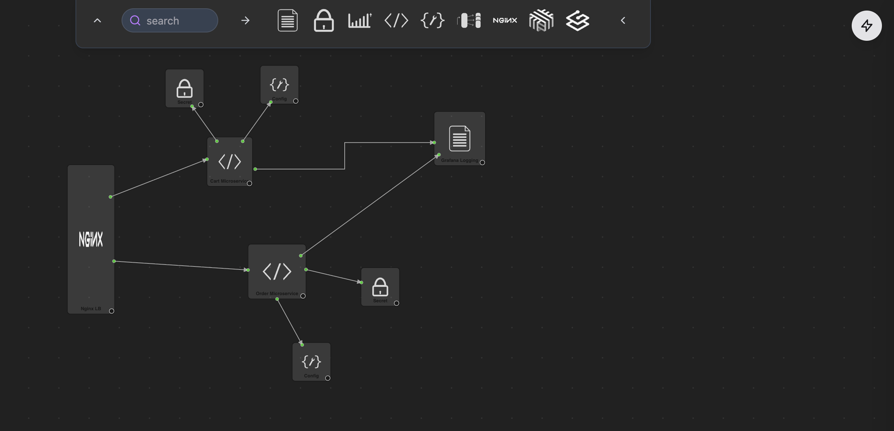

### Interface Components

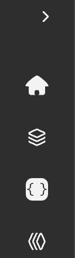

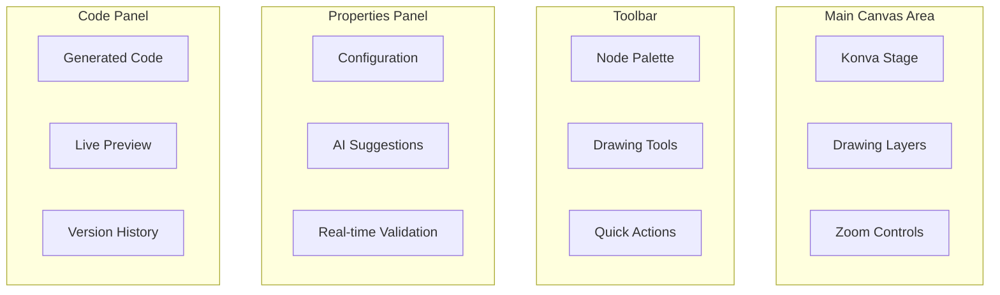

## Navigation and Controls

### Canvas Controls

| Control | Function | Keyboard Shortcut |
|---------|-----------|------------------|
| **Pan** | Move around canvas | `Space + Drag` |
| **Zoom In** | Zoom in on canvas | `Ctrl + +` or `Cmd + +` |
| **Zoom Out** | Zoom out on canvas | `Ctrl + -` or `Cmd + -` |
| **Fit to Screen** | Auto-fit all elements | `Ctrl + 0` or `Cmd + 0` |
| **Select Multiple** | Select multiple nodes | `Shift + Click` |
| **Delete** | Delete selected elements | `Delete` or `Backspace` |

### Toolbar Navigation

1. **Node Palette** - Browse available infrastructure components

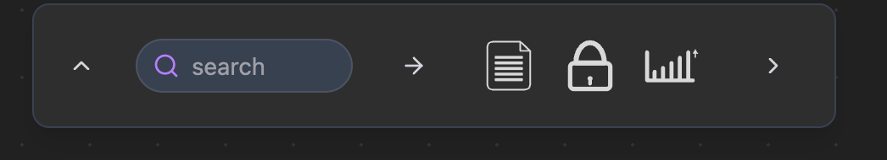

2. **Drawing Tools** - Connection tools and shapes

3. **Quick Actions** - Common operations and shortcuts

## Design Principles

### 1. Start with Intent

Before adding nodes to the canvas, define your architectural intent:

```
Good intent:
"Build a high-availability e-commerce platform with auto-scaling and real-time analytics"

Vague intent:
"Create some services"
```

You can also upload an existing spec file or connect to a document provider such as Notion or Google Docs.

### 2. Think in Data Flows

Design based on how data moves through your system:

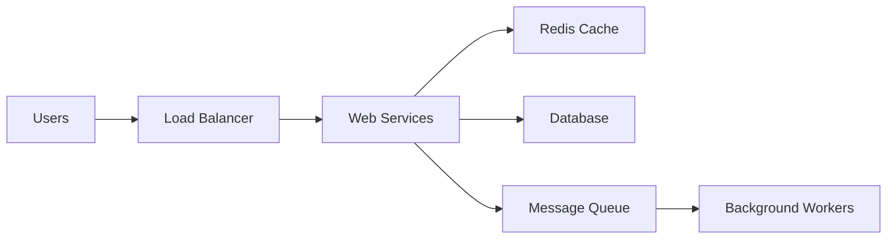

### 3. Use Layered Architecture

Organize your canvas in logical layers:

- **Edge Layer**: Load balancers, CDN, API Gateway
- **Application Layer**: Microservices, APIs
- **Data Layer**: Databases, caches, message queues
- **Infrastructure Layer**: Monitoring, logging, security

## Node Types Deep Dive

### Core Infrastructure Nodes

#### Load Balancer
**Purpose**: Distribute traffic across multiple instances

**Visual**: Diamond shape with arrow indicators

**AI Optimizations**:
- Algorithm selection (round-robin, least connections, IP hash)
- Health check configuration
- SSL/TLS termination
- Cross-zone load balancing

**Configuration Options**:
```yaml
spec:
  type: ApplicationLoadBalancer
  algorithm: least_connections
  healthCheck:
    path: /health
    interval: 30s
    timeout: 5s
    healthyThreshold: 2
    unhealthyThreshold: 3
  ssl:
    enabled: true
    certificateArn: "arn:aws:acm:..."
  routing:
    rules:
      - host: api.example.com
        path: /v1/*
        target: web-service
```

#### Microservice
**Purpose**: Application service container

**Visual**: Rounded rectangle with service icon

**AI Optimizations**:
- Resource allocation based on historical patterns
- Auto-scaling configuration
- Health check endpoints
- Service mesh integration

**Configuration Options**:
```yaml
spec:
  replicas: 3
  image: nginx:1.21
  resources:
    requests:
      cpu: 100m
      memory: 128Mi
    limits:
      cpu: 500m
      memory: 512Mi
  healthChecks:
    livenessProbe:
      httpGet:
        path: /health
        port: 8080
      initialDelaySeconds: 30
      periodSeconds: 10
    readinessProbe:
      httpGet:
        path: /ready
        port: 8080
      initialDelaySeconds: 5
      periodSeconds: 5
  autoscaling:
    enabled: true
    minReplicas: 2
    maxReplicas: 10
    targetCPUUtilizationPercentage: 70
```

#### Database
**Purpose**: Persistent data storage

**Visual**: Cylinder with database icon

**AI Optimizations**:
- Storage engine selection
- Backup strategies
- High availability configuration
- Performance tuning

**Configuration Options**:
```yaml
spec:
  engine: PostgreSQL
  version: 14
  storage:
    size: 100Gi
    type: gp3
    encrypted: true
    backupRetention: 30 days
  highAvailability:
    enabled: true
    standbyCount: 1
  performance:
    instanceClass: db.m5.large
    multiAZ: true
    storageIOPS: 3000
  monitoring:
    enhancedMonitoring: true
    performanceInsights: true
```

### Specialized Nodes

#### Message Queue
**Purpose**: Asynchronous message processing

**Visual**: Trapezoid with queue icon

**AI Optimizations**:
- Queue depth monitoring
- Dead-letter handling
- Partition optimization
- Consumer scaling

#### Cache
**Purpose**: High-speed data caching

**Visual**: Hexagon with lightning bolt

**AI Optimizations**:
- Cache warming strategies
- Invalidation policies
- Cluster configuration
- Memory optimization

#### API Gateway
**Purpose**: External API management

**Visual**: Pentagon with gateway icon

**AI Optimizations**:
- Rate limiting configuration
- Authentication methods
- Request transformation
- API versioning

## Connection Patterns

### Connection Types

| Type | Visual | Meaning | AI Analysis |
|------|--------|----------|-------------|
| **Direct Dependency** | Solid arrow | Required dependency | Performance impact, failure propagation |
| **Async Communication** | Dashed arrow | Event-based communication | Queue depth, latency analysis |
| **Data Flow** | Thick arrow | Data transfer | Volume optimization, compression |
| **Security Boundary** | Red arrow | Security zone transition | Policy enforcement, encryption |

### Best Practice Patterns

#### 1. Microservice with Database
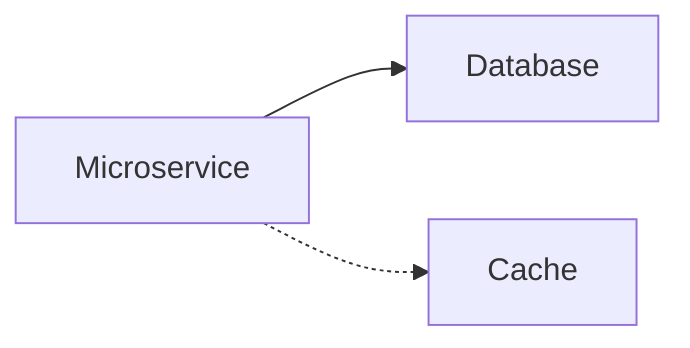
- Direct dependency on database
- Async cache layer for performance
- AI optimizes cache invalidation strategy

#### 2. Event-Driven Architecture
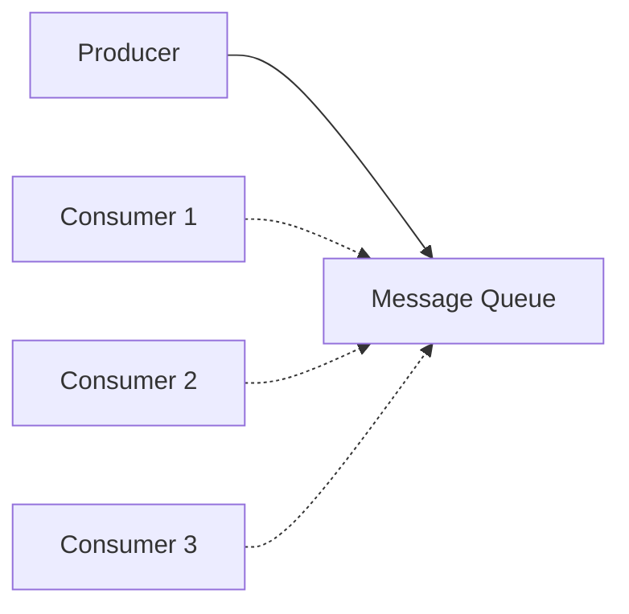
- Producer sends events to queue
- Multiple consumers process events asynchronously
- AI optimizes partition count and scaling

#### 3. High Availability Pattern
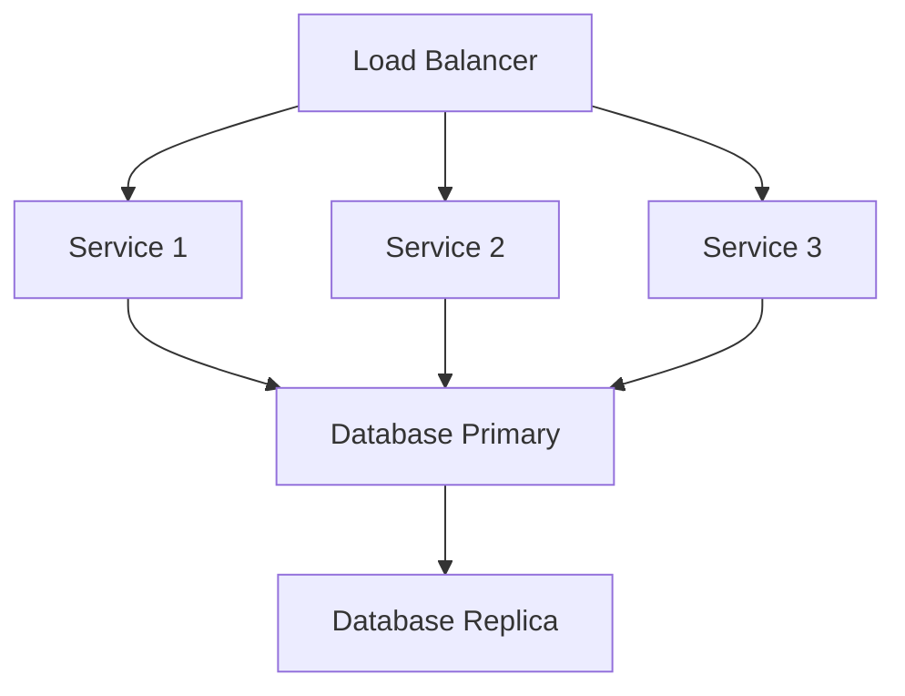
- Multiple service instances behind load balancer
- Database replication for availability
- AI configures failover and scaling

## AI-Assisted Design

### Real-time Suggestions

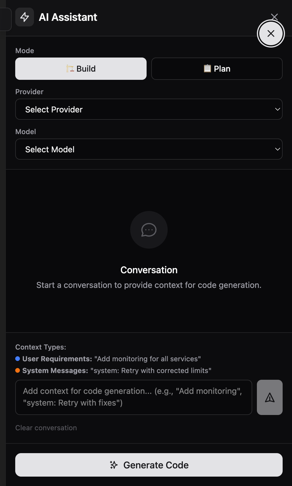

As you design, Kubegram's AI provides intelligent suggestions:

#### Configuration Recommendations
```
Based on similar e-commerce platforms:
• Recommend Redis cache with 1-hour TTL
• Suggest application load balancer for better performance
• Consider CDN for static assets
```

#### Architecture Validation
```
Warning: Database not in private subnet
Recommendation: Move database to isolated network

Warning: No backup strategy configured
Recommendation: Enable daily backups with 30-day retention
```

#### Cost Optimization
```
Cost Optimization Opportunity:
Current setup: $234.56/month
Optimized setup: $156.78/month
Savings: $77.78 (33% reduction)
```

### Smart Auto-Completion

The AI assists with common patterns:

#### Auto-Connect Nodes
When you drag a new node, AI suggests logical connections:
- New microservice → Existing load balancer
- Database → Backup storage
- API Gateway → Authentication service

#### Auto-Configure Resources
Based on node type and connections:
- Microservices: Auto-set health checks
- Databases: Auto-configure backups
- Load balancers: Auto-suggest SSL termination

### Pattern Recognition

Kubegram recognizes common architectural patterns:

#### Microservices Pattern
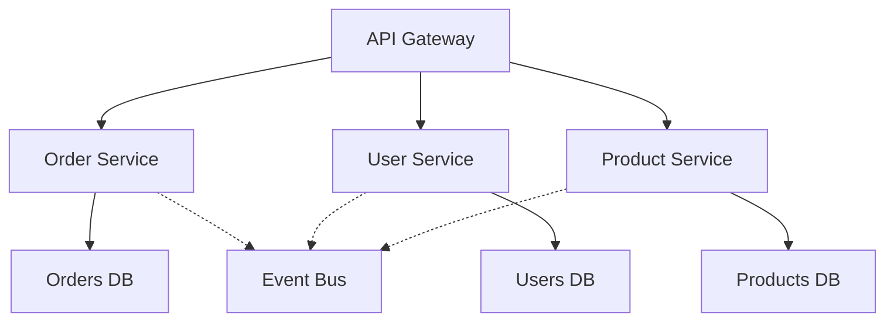

**AI Enhancements**:
- Suggest service mesh implementation
- Recommend distributed tracing
- Configure circuit breakers

## Advanced Design Techniques

### 1. Multi-Environment Architecture

Design for multiple environments using environment-specific configurations:

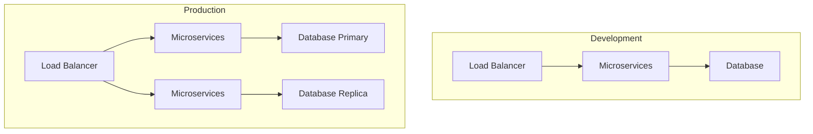

### 2. Hybrid Cloud Architecture

Connect on-premise and cloud resources:

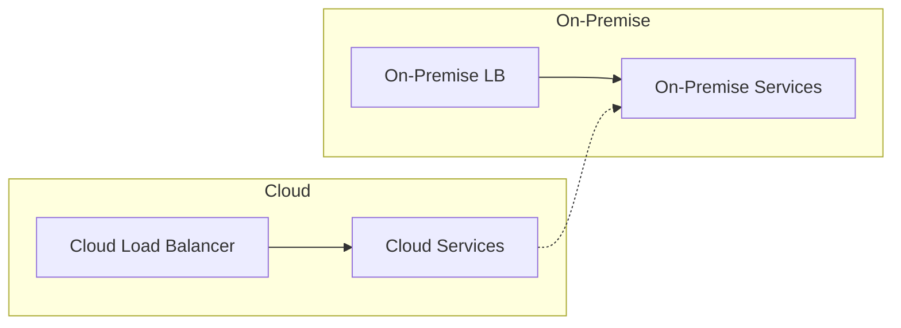

### 3. Micro-Frontends Architecture

Design for independent frontend deployments:

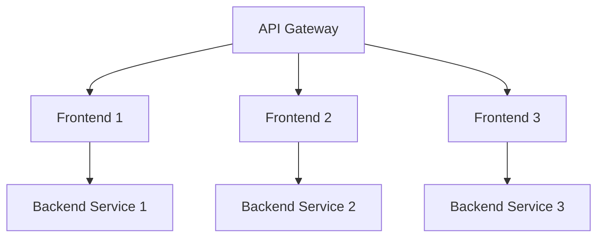

## Customization and Extensions

### Custom Node Types

Create your own infrastructure components:

```typescript
export const customNodeTypes = {
  'custom-analytics': {
    name: 'Analytics Service',
    icon: 'analytics',
    category: 'Business Logic',
    defaultConfig: {
      type: 'Analytics',
      engine: 'Spark',
      clusterSize: 'medium',
      autoScaling: {
        enabled: true,
        minNodes: 2,
        maxNodes: 10
      }
    },
    aiCapabilities: [
      'performance-optimization',
      'cost-prediction',
      'scaling-recommendation'
    ]
  }
};
```

### Custom Validation Rules

Define organization-specific validation rules:

```typescript
export const validationRules = {
  'cost-limit': {
    name: 'Monthly Cost Limit',
    validate: (design) => {
      const estimatedCost = calculateMonthlyCost(design);
      return {
        valid: estimatedCost < 10000,
        message: `Estimated cost $${estimatedCost} exceeds $10,000 limit`
      };
    }
  },
  'security-zone': {
    name: 'Security Zone Compliance',
    validate: (design) => {
      return validateSecurityZones(design);
    }
  }
};
```

## Design Metrics and Analytics

### Real-time Metrics

As you design, Kubegram tracks key metrics:

| Metric | Description | Target |
|--------|-------------|--------|
| **Complexity Score** | Overall design complexity | Moderate |
| **Cost Estimate** | Monthly infrastructure cost | Budget-aligned |
| **Performance Score** | Expected performance | High |
| **Security Rating** | Security posture score | A+ |
| **Compliance Score** | Regulatory compliance | 100% |

### Design Quality Indicators

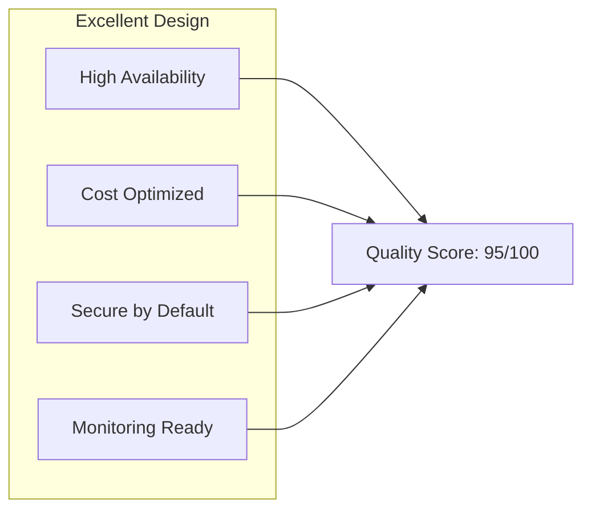

## Validation and Testing

### Automated Validation

Kubegram validates your design in real-time:

#### Infrastructure Validation
- Connection completeness
- Resource dependencies
- Configuration consistency
- Network accessibility

#### Security Validation
- Network policy enforcement
- RBAC configuration
- Secret management
- Compliance rules

#### Performance Validation
- Resource allocation
- Scaling configuration
- Bottleneck identification
- Latency analysis

### Design Testing

Before deployment, test your design:

```bash
# Run design validation
kubegram validate --file design.json

# Simulate deployment
kubegram simulate --file design.json --environment staging

# Generate test plan
kubegram test-plan --file design.json
```

## Best Practices

### Do
- Start with a clear architectural intent
- Use consistent naming conventions
- Implement proper separation of concerns
- Include monitoring and logging nodes
- Design for failure scenarios
- Consider cost implications
- Validate security requirements

### Don't
- Ignore network security boundaries
- Skip backup and disaster recovery
- Forget monitoring requirements
- Over-provision resources
- Ignore compliance requirements
- Create tightly coupled services
- Skip testing and validation

---

## Next Steps

- [Code View](./code_view) — inspect the generated Kubernetes YAML from your canvas design
- [Compare View](./compare_view) — diff your intended design against the live cluster state
- [AI Orchestration Concepts](../AI-orchestration/concepts) — understand how Kubegram selects and routes to AI providers
- [MCP & IDE Integration](../integrations/mcp-integration) — control the canvas from your editor or AI assistant
