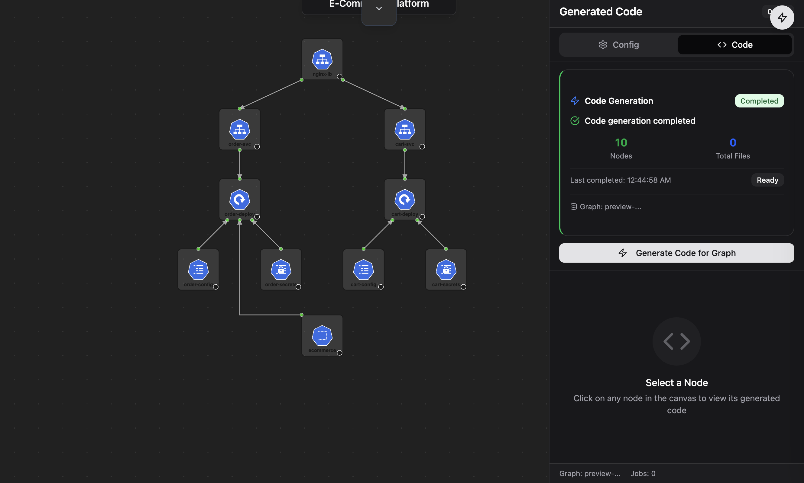

# Code View

The Code View panel shows the infrastructure code generated from your canvas design. It opens alongside the canvas in a split layout so you can inspect the manifest output as you make design changes.

## Features

### Generated Code

Displays the Infrastructure-as-Code output — Kubernetes YAML or Terraform configurations — corresponding to the nodes and connections on your canvas. The code updates automatically as you modify your design.

### Live Preview

The Live Preview tab renders a real-time view of your resources, letting you see the effect of design changes before generating final manifests.

### Version History

Track changes and revert to earlier versions of your configuration. This lets you experiment freely without losing prior work.

---

## See Also

- [Visual Designer Guide](./canvas-guide) — learn how to build and connect nodes on the canvas
- [Compare View](./compare_view) — diff your intended design against the live cluster state
