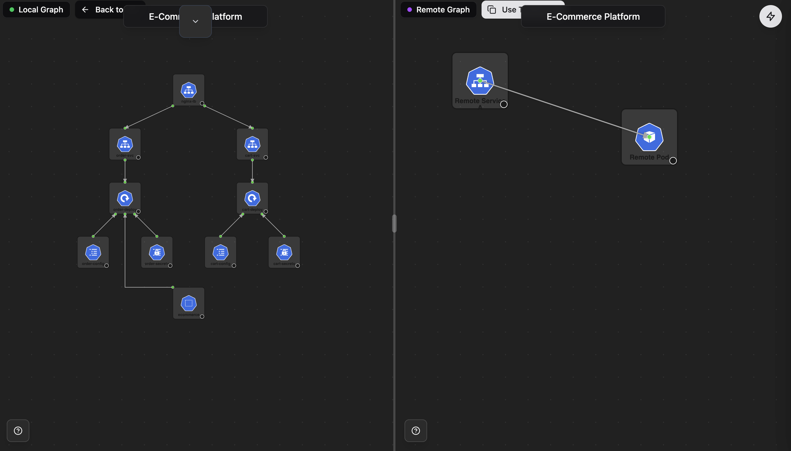

# Compare View

The Compare View panel shows the differences between your intended infrastructure design and the actual state of your deployed cluster.

## Overview

Compare View diffs the Kubernetes resources generated from your canvas design against the resources already running in your cluster. Any divergence between what Kubegram generated (desired state) and what is actually deployed (live state) is highlighted as drift.

Reviewing drift before applying changes helps you:

- Catch unintended manual changes to the cluster
- Understand the impact of a new design before deploying
- Maintain confidence that your GitOps source of truth matches production

---

## See Also

- [Visual Designer Guide](./canvas-guide) — design and refine your infrastructure on the canvas
- [Code View](./code_view) — inspect the generated Kubernetes YAML for your current design
- [GitHub Application](../deployment/using-the-kubegram-application) — how generated manifests flow through a Pull Request and into Argo CD
